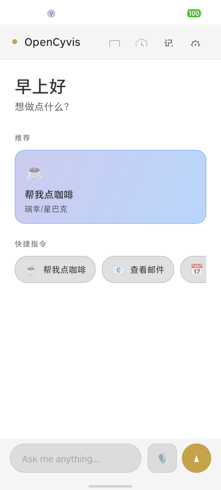

<picture>
  <source media="(prefers-color-scheme: dark)" srcset=".github/github-banner-dark.png">
  <source media="(prefers-color-scheme: light)" srcset=".github/github-banner-light.png">
  
</picture>

<p align="center">
  <strong>你的开源 AI 手机。</strong><br>
  商业 AI 手机是黑箱。这个不是。<br>
  <strong>v2.0 即将到来，并且适用于任何手机。</strong><br><br>
  <sub><b>Open</b> <b>Cy</b>ber Jar<b>vis</b></sub>
</p>

<p align="center">
  <a href="README.md">English</a> •
  <a href="#快速开始">快速开始</a> •
  <a href="#路线图">路线图</a> •
  <a href="CONTRIBUTING.md">参与贡献</a>
</p>

<p align="center">
  <a href="LICENSE"></a>
  <a href="#v20-预告"></a>
  <a href="#快速开始"></a>
  <a href="#"></a>
  <a href="#支持的模型"></a>
  <a href="#"></a>
</p>

---

## v2.0 预告

v2.0 正在准备成普通应用式体验：日常使用不需要定制 ROM，也不需要电脑设置。安装应用，跟随设置向导，就能让 OpenCyvis 在你的 Android 手机上工作。

新变化：

- **适用于任何 Android 手机** — v2.0 面向日常用户，不再要求定制 ROM
- **通过聊天远程控制** — 从 Telegram 或飞书发送任务，并在聊天里收到结果和截图
- **例行任务** — 保存常用任务，一键再次运行
- **深色模式** — 应用和控制界面支持完整日间/夜间主题
- **适配多种 ROM** — 适配 MIUI、ColorOS、OriginOS 以及其他 Android 变体

**v2.0 即将开源。** v1.0 目前仍可供希望从源码构建的开发者使用。

---

## 为什么

当一家公司推出「AI 手机」，他们获得了你屏幕、应用、消息、银行账户的完整访问权——而你看不到运行的是什么模型，无法验证什么数据离开了设备，也无法选择替代方案。

豆包 AI 手机？锁定字节跳动的模型。三星 Galaxy AI？锁定三星 + Google。Google 内置 AI？只有 Gemini。他们给你什么，你就用什么。

**你至少应该有选择的权利。**

OpenCyvis 是开源替代方案：你能看到每一行代码，你来选 AI 模型，你决定数据去向。用本地模型时，任何数据都不会离开你的设备。

---

## 它做什么

OpenCyvis 把 Android 变成 AI 手机。用自然语言给它一个任务——它看到你的屏幕，理解 UI，像你一样操作应用。

**"找附近评分最高的咖啡店，导航过去"** — 打开点评应用，搜索，按评分排序，点击第一个，开始导航。

**"查下周五去上海最便宜的直飞机票"** — 打开旅行应用，输入日期，筛选直飞，按价格排序。

**"设个早上 7 点的闹钟，打开勿扰模式，切换到暗色主题"** — 一口气串联时钟、设置、显示三个应用。

### 后台运行

大多数 AI 工具在工作时会锁定你的屏幕。OpenCyvis 在**虚拟显示器**上运行——一个隔离的后台屏幕。AI 帮你订机票的同时，你照常刷微博。

```
┌─────────────────────┐    ┌─────────────────────┐
│   你的屏幕            │    │   虚拟显示器          │
│                      │    │   (AI 在这里工作)     │
│   刷微博、聊微信、     │    │                      │
│   看视频——            │    │   订机票、发消息、     │
│   手机照常用          │    │   下单购物            │
│                      │    │                      │
└─────────────────────┘    └─────────────────────┘
      你用这个                   AI 用这个
```

随时观看 AI 工作。觉得不对就接管。处理完交还，AI 从中断处继续。

<p align="center">
  
</p>
<p align="center">
  <sub>v2 预览：无历史任务的首页与例行任务</sub>
</p>

---

## 横向对比

| | 商业 AI 手机 | 云手机 | 手机控制脚本 | **OpenCyvis** |
|---|:---:|:---:|:---:|:---:|
| **开源** | ❌ | ❌ | ⚠️ | ✅ |
| **自选 AI 模型** | ❌ | ❌ | ⚠️ | ✅ |
| **数据留在设备** | ❌ | ❌ | ⚠️ | ✅ |
| **AI 工作时手机照常用** | ⚠️ | ✅ | ❌ | ✅ |
| **支持所有应用** | ⚠️ | ⚠️ | ⚠️ | ✅ |
| **无需电脑设置** | ⚠️ | ⚠️ | ❌ | ✅ |
| **适用于日常手机** | ✅ | ⚠️ | ❌ | ✅ |

---

## 功能

- **适用于任何 Android 手机** — v2.0 为日常用户移除定制 ROM 路径
- **通过聊天远程控制** — 从 Telegram 或飞书发送任务，并在同一会话里收到结果
- **例行任务** — 保存常用任务，一键再次运行
- **深色模式** — 应用和控制界面支持完整日间/夜间主题
- **适配多种 ROM** — 适配 MIUI、ColorOS、OriginOS 以及其他 Android 变体
- **后台运行** — AI 在自己的空间里工作，你的手机照常用
- **任意 AI 模型** — Qwen、Claude、GPT、Llama、Gemma，或使用本地/私有选项
- **自然语言** — 用文字或语音描述你想做的事
- **理解屏幕** — 理解屏幕上可见的内容，并操作正确控件
- **观看 & 接管** — 实时观察 AI 操作，随时接管，无缝交还
- **不确定时会问你** — 遇到歧义时暂停（"你说的'张伟'是哪个？有三个"），而非盲猜
- **安全防护** — 重复动作检测，敏感操作确认
- **离线语音** — 设备端语音识别（Sherpa-ONNX），无需联网
- **开源** — 审计代码，而不是相信黑箱

---

## 支持的模型

OpenCyvis 不绑定模型。使用你自己的 AI 账号，连接私有服务，或在最重视隐私时选择本地运行。

| Provider | 示例 | 说明 |
|:---|:---|:---|
| **云端模型** | Qwen、GPT、Claude | 需要更好质量和速度时，使用托管模型 |
| **私有服务** | 团队或个人服务 | 让请求经过你控制的基础设施 |
| **本地模型** | Gemma、Llama、Qwen | 运行任务时不把手机上下文发送给第三方服务 |

### 本地模型实测

我们用 4 个真实 UI 场景（打开设置、拨号、处理不可能任务、查找联系人）测试了 6 个本地模型：

| 模型 | 体积 | 速度 | 通过率 |
|:---|:---:|:---:|:---:|
| **Gemma 4 26B-A4B** Q4 | 17 GB | 63 tok/s | **4/4** |
| **Gemma 4 E2B** Q4 | 1.8 GB | 41 tok/s | **4/4** |
| **Gemma 4 31B** Q4 | 19 GB | 16 tok/s | 4/4 |
| **Qwen 3.5 35B-A3B** Q4 | 22 GB | 47 tok/s | 3/4 |
| **Gemma 4 E4B** Q4 | 3 GB | 61 tok/s | 3/4 |
| **GUI-Owl 1.5 8B** Q4 | 5.4 GB | 75 tok/s | 2/4 |

> **推荐：** Gemma 4 26B-A4B — 速度、质量、显存的最佳平衡。  
> **极简：** Gemma 4 E2B — 仅 1.8 GB，依然通过全部 4 项测试。

---

## 隐私 & 安全

拥有完整手机访问权限的 AI 智能体，是你能运行的最高特权软件之一。这不是一个可以说「请相信我们」的地方。

- **任务上下文只用于你交给 OpenCyvis 的工作**
- **AI 服务你来选** — 托管、私有或本地
- **无遥测、无分析、不偷偷联网** — 零追踪代码
- **开源** — 安全研究者、记者、任何人都能审计
- **本地模型选项** — 获得最高隐私

```
你的任务 ──→ OpenCyvis（在你的手机上）──→ 你选择的 AI ──→ 结果
                                      ↑
                         你决定请求发送到哪里
```

---

## 快速开始

### v2.0 — 即将推出

v2.0 正在准备更简单的应用内设置流程：

1. 安装应用
2. 跟随设置向导
3. 开始发送任务

### v1.0 — 现在可用

v1.0 仍然可供希望从源码构建和部署的开发者使用。下面的前置条件**仅适用于 v1.0**。

#### v1.0 前置条件

- AOSP 系统镜像
- 平台签名密钥（系统应用权限）

这些不是计划中的 v2.0 要求。OpenCyvis v1.0 是特权系统应用，因此需要系统级权限来截屏和注入输入。

#### 从源码编译

```bash
git clone https://github.com/opencyvis/opencyvis-phone.git
cd opencyvis-phone/android
./gradlew assembleRelease
```

#### 部署到设备

详见 [docs/aosp-deployment.md](docs/aosp-deployment.md)，包含 AOSP 兼容设备的符号链接配置、device makefile 和平台签名指南。

#### 没有设备？用模拟器尝鲜

```bash
./scripts/deploy-emu.sh
```

#### 配置

在应用内设置 LLM Provider，或通过 deeplink：

```bash
# 本地 Ollama（完全私密，无需 API key）
adb shell am start -a android.intent.action.VIEW \
  -d "opencyvis://config?provider=ollama&base_url=http://localhost:11434&model=gemma4:26b"

# 云端 API
adb shell am start -a android.intent.action.VIEW \
  -d "opencyvis://config?provider=openai&base_url=https://api.openai.com/v1&api_key=YOUR_KEY&model=qwen-vl-max"
```

---

## 路线图

### 下一步
- v2.0 应用式设置流程
- 远程 IM 控制打磨
- 例行任务和设置页体验
- 跨设备协同（手机 + 桌面）

### 愿景
- AI 手机应该是公共基础设施，而非私有产品。我们的目标是建立开放的移动 AI 智能体标准，让每个人都能拥有、审计和掌控自己的 AI 助手。

---

## 参与贡献

详见 [CONTRIBUTING.md](CONTRIBUTING.md)。欢迎代码、Bug 报告、安全审计、翻译和文档贡献。

## 许可证

[Apache 2.0](LICENSE)

## 致谢

- [Sherpa-ONNX](https://github.com/k2-fsa/sherpa-onnx) — 设备端语音识别 (Apache 2.0)
